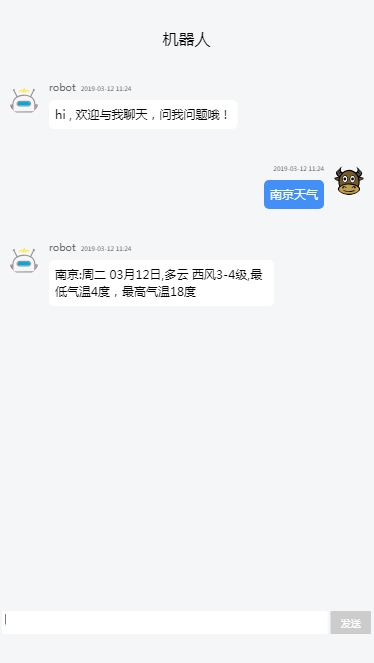
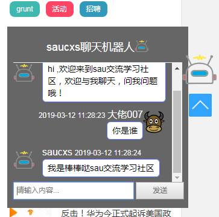
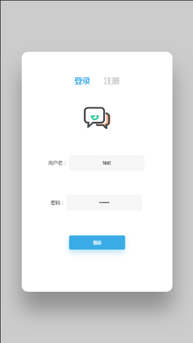

# chat-robot
chat-robot一个简单的聊天机器人的入门，目前：
+ 1、使用koa+vue，简单的聊天实现
+ 2、使用thinkjs+jq，简单的聊天实现
+ 3、使用koa+vue，带有注册，邮箱激活，登陆，聊天实现

# 栗子1：chat-robot-koa-vue
1、进入到chat-robot-koa-vue文件夹下
在chat-robot-koa根目录下，执行`npm i`，然后执行`npm run start`;

在chat-robot-vue根目录下，执行`npm i`，然后执行`npm run dev`;

访问 http://localhost:8080

2、展示

# 栗子2：chat-robot-thinkjs-jq
已经接入聊天机器人，欢迎访问sau交流学习社区：https://www.mwcxs.top

展示：

# 栗子3：chat-robot-koa-vue-login
1、进入到chat-robot-koa-vue-login文件下
在chat-robot-koa根目录下，执行`npm i`，然后执行`npm run start`;

在chat-robot-vue根目录下，执行`npm i`，然后执行`npm run dev`;

数据库文件：在chat-robot-koa-vue-login的根目录下chat_robot.sql

访问 http://localhost:8080

2、展示

